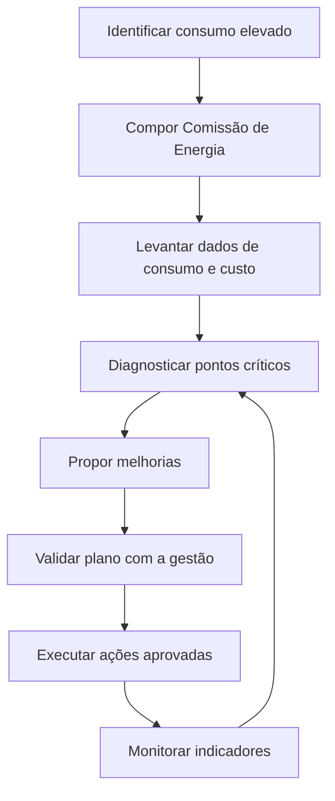

# Comissão de Energia

## Contexto

O campus está enfrentando um problema de consumo elevado de energia. Para apoiar a tomada de decisão, será criada uma Comissão de Energia com o objetivo de pesquisar as causas do aumento de consumo, propor melhorias e acompanhar ações de uso eficiente da energia elétrica no campus.

A comissão deve envolver professores vinculados ao Laboratório de Energia (LAME), aproveitando a competência técnica do laboratório para análise de consumo, eficiência energética, medições, diagnóstico de cargas e proposição de soluções.

## Objetivo

Pesquisar o consumo de energia do campus e propor melhorias técnicas, administrativas e educativas para reduzir desperdícios, melhorar a eficiência energética e apoiar decisões de investimento em infraestrutura.

## Composição sugerida

- Professores vinculados ao Laboratório de Energia (LAME).
- Representante da gestão do campus.
- Representante da infraestrutura/manutenção.
- Representante da área administrativa responsável pelo acompanhamento de despesas.
- Representante discente ou bolsista, quando houver projeto associado.

## Atribuições

- Levantar dados históricos de consumo e custo de energia elétrica do campus.
- Identificar ambientes, equipamentos, horários e processos com maior consumo.
- Avaliar oportunidades de economia e eficiência energética.
- Propor medidas de curto, médio e longo prazo.
- Apoiar campanhas de conscientização sobre uso racional de energia.
- Indicar necessidades de medição, monitoramento ou automação.
- Elaborar relatório com diagnóstico, recomendações e priorização das ações.
- Acompanhar a execução das ações aprovadas pela gestão.

## Plano inicial de trabalho

| Etapa | Atividade | Responsáveis sugeridos | Resultado esperado |
| --- | --- | --- | --- |
| 1 | Compor a comissão | Gestão do campus e professores do LAME | Lista de membros definida |
| 2 | Levantar dados de consumo | Comissão e setor administrativo | Histórico de consumo e custos organizado |
| 3 | Diagnosticar principais fontes de consumo | Professores do LAME e infraestrutura | Mapa inicial de pontos críticos |
| 4 | Propor melhorias | Comissão | Lista priorizada de ações |
| 5 | Validar com a gestão | Comissão e direção | Plano de ação aprovado |
| 6 | Acompanhar execução | Comissão | Relatórios periódicos de acompanhamento |

## Cronograma sugerido

| Período | Entrega |
| --- | --- |
| Semana 1 | Convite aos membros e composição inicial da comissão |
| Semana 2 | Levantamento de contas, contratos, medições e dados disponíveis |
| Semanas 3 e 4 | Diagnóstico técnico inicial e identificação dos pontos críticos |
| Semana 5 | Proposta de melhorias e priorização das ações |
| Semana 6 | Apresentação do relatório inicial para a gestão |
| Mensalmente | Acompanhamento das ações e atualização dos indicadores |

## Exemplos de ações a avaliar

- Revisão de horários de funcionamento de equipamentos de alto consumo.
- Avaliação de iluminação, climatização e laboratórios.
- Instalação ou melhoria de medidores setoriais.
- Campanhas de conscientização para servidores, estudantes e terceirizados.
- Manutenção preventiva em equipamentos com consumo elevado.
- Estudo de viabilidade para geração distribuída, automação ou substituição de equipamentos.

## Indicadores sugeridos

- Consumo mensal de energia elétrica.
- Custo mensal de energia elétrica.
- Consumo por bloco, setor ou laboratório, quando houver medição disponível.
- Consumo em horário de ponta e fora de ponta.
- Economia estimada e economia realizada após cada ação.
- Número de ações implementadas.

## Visão geral do fluxo

