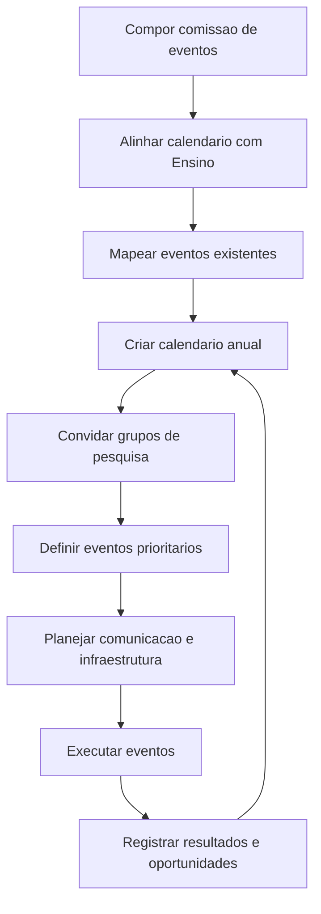

# Comissão de Eventos

## Finalidade

Planejar e articular eventos que promovam o campus, aumentem sua visibilidade junto à comunidade e contribuam para atrair mais estudantes, parceiros e projetos.

A Comissão de Eventos deve atuar de forma integrada com o Ensino, a Pesquisa, a Extensão, a Inovação, a comunicação institucional e os grupos de pesquisa do campus.

## Justificativa

Eventos bem planejados ajudam o campus a apresentar suas áreas de atuação, laboratórios, cursos, projetos, grupos de pesquisa e oportunidades de formação. Eles também fortalecem a relação com escolas, empresas, instituições públicas, comunidade local, estudantes atuais e futuros estudantes.

Uma comissão específica permite organizar um calendário institucional de eventos, evitar sobreposição de datas, envolver os grupos de pesquisa e transformar os eventos em estratégia permanente de promoção do campus e captação de novas oportunidades.

## Objetivo

Criar, manter e executar um calendário de eventos do campus que:

- promova os cursos e áreas de atuação do campus;
- aumente o interesse de novos estudantes;
- divulgue projetos de ensino, pesquisa, extensão e inovação;
- aproxime o campus de escolas, empresas e comunidade;
- estimule os grupos de pesquisa a apresentarem suas ações;
- gere oportunidades de novos projetos, parcerias e captação institucional.

## Composição sugerida

- Representante da gestão do campus.
- Representante do Ensino.
- Representante da Pesquisa.
- Representante da Extensão.
- Representante da Inovação ou parcerias.
- Representante da comunicação institucional.
- Representantes dos grupos de pesquisa, quando houver eventos relacionados às suas áreas.
- Representantes discentes ou bolsistas de apoio, quando necessário.

## Atribuições

- Criar e manter um calendário anual de eventos do campus em conjunto com o Ensino.
- Identificar eventos estratégicos para promoção dos cursos e áreas do campus.
- Solicitar participação dos grupos de pesquisa nos eventos institucionais.
- Articular mostras, palestras, oficinas, visitas guiadas, feiras e encontros temáticos.
- Apoiar eventos que aproximem o campus de escolas, empresas, egressos e comunidade.
- Planejar comunicação e divulgação dos eventos.
- Mapear infraestrutura necessária para cada evento.
- Registrar evidências, públicos alcançados, resultados e oportunidades geradas.
- Avaliar o impacto dos eventos na captação de estudantes, projetos e parcerias.

## Frentes de trabalho

| Frente | Finalidade | Entrega esperada |
| --- | --- | --- |
| Calendário institucional | Organizar datas, temas e prioridades com o Ensino | Calendário anual de eventos |
| Promoção do campus | Divulgar cursos, laboratórios e oportunidades | Plano de eventos de promoção |
| Grupos de pesquisa | Envolver grupos em mostras, palestras e oficinas | Agenda de participação dos grupos |
| Comunicação | Divulgar eventos e públicos-alvo | Plano de comunicação |
| Infraestrutura | Planejar espaços, equipamentos e apoio operacional | Mapa de necessidades |
| Parcerias | Aproximar escolas, empresas e instituições | Lista de convidados e parceiros |
| Resultados | Registrar alcance e oportunidades geradas | Relatório de eventos |

## Plano inicial de trabalho

| Etapa | Atividade | Resultado esperado |
| --- | --- | --- |
| 1 | Compor a comissão | Representantes definidos |
| 2 | Alinhar com o Ensino | Diretrizes e datas acadêmicas consideradas |
| 3 | Mapear eventos existentes | Lista de eventos já previstos no campus |
| 4 | Construir calendário anual | Calendário integrado de eventos |
| 5 | Convidar grupos de pesquisa | Grupos mobilizados para participar |
| 6 | Definir eventos prioritários | Eventos com maior potencial de promoção do campus |
| 7 | Planejar comunicação e infraestrutura | Plano operacional por evento |
| 8 | Executar e avaliar eventos | Relatórios e indicadores consolidados |

## Tipos de eventos sugeridos

- Semana Nacional de Ciência e Tecnologia (SNCT).
- Semana Estadual de Ciência e Tecnologia.
- Integra Ifes.
- ESX.
- Mostra de cursos do campus.
- Feira de projetos de ensino, pesquisa, extensão e inovação.
- Visitas guiadas para escolas.
- Encontros com empresas e parceiros.
- Oficinas e minicursos para estudantes do ensino médio.
- Seminários dos grupos de pesquisa.
- Mostra de laboratórios.
- Eventos de integração com egressos.
- Eventos temáticos vinculados a datas nacionais, científicas ou tecnológicas.

## Cronograma sugerido

| Período | Entrega |
| --- | --- |
| Semana 1 | Comissão composta |
| Semana 2 | Reunião de alinhamento com o Ensino |
| Semana 3 | Levantamento dos eventos existentes |
| Semana 4 | Primeira versão do calendário anual |
| Semana 5 | Convite aos grupos de pesquisa |
| Semana 6 | Definição dos eventos prioritários |
| Mensalmente | Revisão do calendário e acompanhamento dos eventos |
| Após cada evento | Registro de público, evidências, resultados e oportunidades |

## Indicadores sugeridos

- Número de eventos realizados.
- Número de participantes por evento.
- Número de escolas, empresas ou instituições participantes.
- Número de grupos de pesquisa envolvidos.
- Número de cursos, laboratórios ou projetos apresentados.
- Número de oportunidades de projetos ou parcerias identificadas.
- Número de contatos de estudantes interessados.
- Alcance das ações de comunicação.

## Visão geral do fluxo

