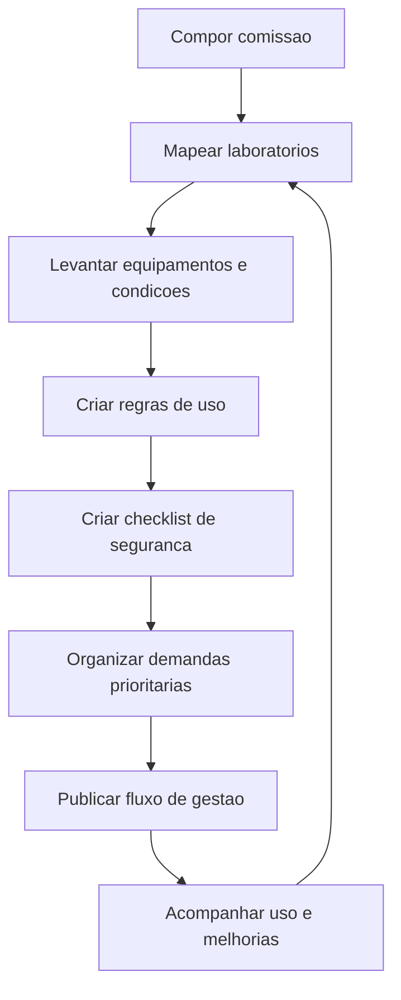

# Comissão de Gestão de Laboratórios

## Finalidade

Criar uma comissão para apoiar a gestão integrada dos laboratórios do campus, organizando uso, manutenção, segurança, infraestrutura, inventário, demandas de projetos e planejamento de melhorias.

A comissão deve atuar como instância de apoio à gestão, aos professores, aos técnicos administrativos e aos usuários dos laboratórios, buscando melhorar a organização dos espaços e a previsibilidade das demandas.

## Justificativa

Os laboratórios são espaços estratégicos para ensino, pesquisa, extensão, inovação e prestação de serviços à comunidade. A ausência de uma gestão integrada pode gerar conflitos de agenda, dificuldade de manutenção, fragilidade no controle de equipamentos, problemas de segurança e baixa previsibilidade para projetos que dependem desses espaços.

A Comissão de Gestão de Laboratórios deve apoiar a criação de rotinas, registros e critérios comuns para uso dos laboratórios, fortalecendo a infraestrutura acadêmica e técnica do campus.

## Objetivo

Organizar a gestão dos laboratórios do campus, garantindo melhor planejamento de uso, conservação dos espaços, controle de equipamentos, apoio aos projetos e articulação entre docentes, técnicos administrativos e gestão.

## Composição

A comissão será formada por quatro membros:

| Representação | Quantidade | Papel |
| --- | --- | --- |
| Professores | 2 | Apoiar planejamento acadêmico, uso didático, projetos e necessidades de ensino, pesquisa, extensão e inovação |
| Técnicos administrativos | 2 | Apoiar controle operacional, registros, infraestrutura, manutenção, segurança e funcionamento dos laboratórios |

## Atribuições

- Mapear laboratórios, responsáveis, equipamentos e condições de uso.
- Criar ou atualizar regras de uso dos laboratórios.
- Organizar calendário de uso, reservas e prioridades.
- Apoiar levantamento de demandas de manutenção e infraestrutura.
- Apoiar controle de equipamentos, insumos e patrimônios.
- Identificar riscos de segurança e necessidades de adequação.
- Apoiar projetos que demandem uso intensivo dos laboratórios.
- Propor melhorias de gestão, sinalização, documentação e rotinas.
- Consolidar relatórios periódicos sobre situação dos laboratórios.

## Frentes de trabalho

| Frente | Finalidade | Entrega esperada |
| --- | --- | --- |
| Mapeamento | Identificar laboratórios, responsáveis e condições de uso | Inventário inicial dos laboratórios |
| Agenda e uso | Organizar reservas, horários e prioridades | Calendário ou planilha de uso |
| Infraestrutura | Registrar demandas de manutenção e melhorias | Lista priorizada de demandas |
| Segurança | Identificar riscos e necessidades de adequação | Checklist de segurança |
| Equipamentos e insumos | Apoiar controle de bens, equipamentos e materiais | Registro atualizado |
| Projetos | Apoiar demandas de projetos que usam laboratórios | Fluxo de solicitação e acompanhamento |

## Plano inicial de trabalho

| Etapa | Atividade | Resultado esperado |
| --- | --- | --- |
| 1 | Compor a comissão | Dois professores e dois técnicos administrativos definidos |
| 2 | Mapear laboratórios | Lista de laboratórios, responsáveis e usos principais |
| 3 | Levantar equipamentos e condições | Diagnóstico inicial de infraestrutura e equipamentos |
| 4 | Criar regras de uso | Critérios de reserva, prioridade e responsabilidades |
| 5 | Criar checklist de segurança | Pontos mínimos de segurança e funcionamento |
| 6 | Organizar demandas prioritárias | Lista de manutenção, compras e melhorias |
| 7 | Publicar fluxo de gestão | Processo de solicitação, uso e acompanhamento documentado |

## Cronograma sugerido

| Período | Entrega |
| --- | --- |
| Semana 1 | Comissão composta |
| Semana 2 | Laboratórios mapeados |
| Semana 3 | Diagnóstico inicial de equipamentos e infraestrutura |
| Semana 4 | Regras de uso e reserva definidas |
| Semana 5 | Checklist de segurança criado |
| Semana 6 | Demandas prioritárias consolidadas |
| Mensalmente | Revisão de agenda, pendências e melhorias |

## Indicadores sugeridos

- Número de laboratórios mapeados.
- Número de equipamentos registrados.
- Número de demandas de manutenção identificadas.
- Número de demandas resolvidas.
- Percentual de laboratórios com regras de uso definidas.
- Número de projetos apoiados nos laboratórios.
- Número de ocorrências ou riscos registrados.

## Visão geral do fluxo

