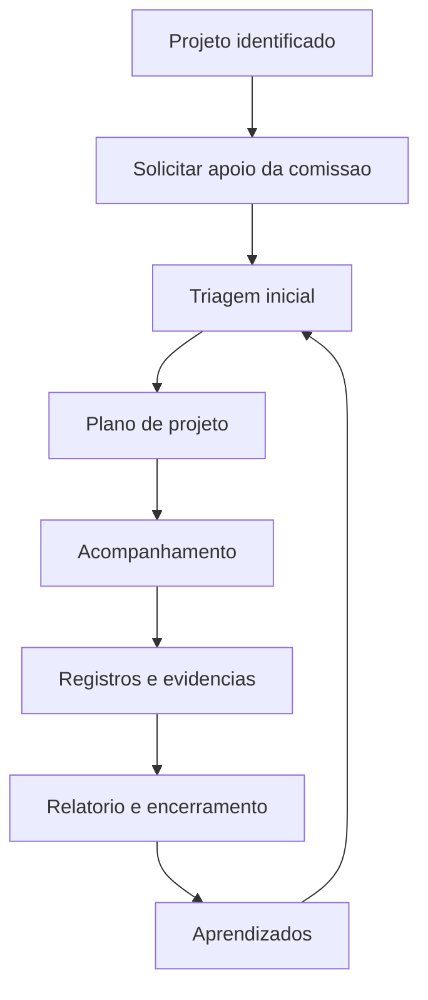

# Comissão de Gestão de Projetos

## Finalidade

Constituir a Comissão de Gestão de Projetos do Campus para apoiar a organização, o acompanhamento e o encerramento de projetos institucionais, incluindo projetos de pesquisa, extensão, inovação, ensino, infraestrutura, eventos e parcerias.

A comissão terá atuação de suporte, orientação e acompanhamento, sem substituir a responsabilidade dos proponentes, coordenadores de projetos ou setores competentes.

## Justificativa

O campus desenvolve projetos com diferentes níveis de complexidade, prazos, documentos, riscos, parceiros, recursos e demandas internas. A ausência de um acompanhamento padronizado pode gerar perda de informações, atrasos, dificuldade de articulação entre setores, fragilidade documental e problemas no encerramento das ações.

A Comissão de Gestão de Projetos busca criar um apoio institucional simples e contínuo para melhorar o planejamento, a execução, o registro e a prestação de contas dos projetos do campus.

## Objetivo

Apoiar os projetos do campus desde a concepção até o encerramento, oferecendo orientação sobre planejamento, acompanhamento de entregas, documentação, riscos, comunicação, articulação com setores internos e registro de evidências.

## Responsável

Luciano Toledo será o responsável pela coordenação da comissão.

## Composição

A comissão terá no máximo quatro pessoas:

| Papel | Descrição |
| --- | --- |
| Luciano Toledo | Responsável pela comissão e coordenação geral |
| Representante da gestão do campus | Apoio institucional, priorização e articulação com a direção |
| Representante administrativo | Apoio a documentos, registros, prazos, processos e prestação de contas |
| Representante técnico ou acadêmico rotativo | Apoio especializado conforme a natureza do projeto acompanhado |

O representante técnico ou acadêmico rotativo poderá ser indicado conforme o tipo de projeto, como pesquisa, extensão, inovação, infraestrutura, laboratório, evento ou parceria externa.

## Atribuições

- Apoiar a estruturação inicial de projetos.
- Orientar a elaboração de planos de projeto.
- Apoiar definição de escopo, entregas, responsáveis e cronograma.
- Acompanhar prazos, pendências, riscos e pontos de atenção.
- Apoiar a organização de documentos, evidências e decisões.
- Articular setores internos necessários à execução dos projetos.
- Apoiar relatórios, prestação de contas e encerramento.
- Propor modelos, checklists e fluxos simples de gestão de projetos.
- Registrar gargalos recorrentes e propor melhorias institucionais.

## Frentes de trabalho

| Frente | Finalidade | Entrega esperada |
| --- | --- | --- |
| Planejamento | Apoiar escopo, objetivos, cronograma e entregas | Modelo de plano de projeto |
| Acompanhamento | Monitorar prazos, responsáveis e pendências | Quadro ou planilha de acompanhamento |
| Documentação | Organizar registros, evidências e decisões | Checklist documental |
| Riscos | Identificar riscos administrativos, técnicos e operacionais | Matriz simples de riscos |
| Comunicação | Apoiar divulgação e alinhamentos internos | Plano de comunicação do projeto |
| Encerramento | Apoiar relatório final e prestação de contas | Checklist de encerramento |

## Produtos esperados

| Produto | Finalidade |
| --- | --- |
| Lista de projetos ativos | Mapear projetos que podem precisar de suporte |
| Modelo de plano de projeto | Padronizar escopo, objetivos, entregas, responsáveis e cronograma |
| Modelo de acompanhamento | Registrar status, prazos, riscos, responsáveis e pendências |
| Checklist documental | Orientar registros e evidências mínimas |
| Checklist de encerramento | Apoiar relatório final, prestação de contas e arquivamento |
| Fluxo de suporte a projetos | Definir como solicitar apoio e como a comissão acompanha os projetos |

## Funcionamento inicial

1. O projeto é identificado ou o proponente solicita apoio.
2. A comissão realiza triagem inicial.
3. O projeto recebe orientação para preencher o plano de projeto.
4. A comissão acompanha prazos, riscos e pendências.
5. Registros e evidências são organizados durante a execução.
6. Ao final, a comissão apoia relatório, prestação de contas e encerramento.
7. Aprendizados são registrados para melhorar o fluxo.

## Plano inicial de trabalho

| Etapa | Atividade | Resultado esperado |
| --- | --- | --- |
| 1 | Formalizar a comissão | Comissão definida com Luciano Toledo como responsável |
| 2 | Levantar projetos ativos do campus | Lista inicial de projetos em andamento |
| 3 | Criar modelo de plano de projeto | Documento padrão para novos projetos |
| 4 | Criar modelo de acompanhamento | Quadro ou planilha de status dos projetos |
| 5 | Criar checklist de documentação | Lista mínima de registros e evidências |
| 6 | Selecionar projetos piloto | Projetos acompanhados pela comissão |
| 7 | Ajustar método de apoio | Melhorias incorporadas após piloto |
| 8 | Publicar fluxo de suporte | Processo institucional documentado |

## Cronograma de implantação

| Período | Entrega |
| --- | --- |
| Semana 1 | Comissão formalizada e Luciano Toledo confirmado como responsável |
| Semana 2 | Lista de projetos ativos levantada |
| Semana 3 | Modelo de plano de projeto criado |
| Semana 4 | Modelo de acompanhamento e checklists criados |
| Semanas 5 e 6 | Projetos piloto acompanhados |
| Semana 7 | Ajustes realizados com base no piloto |
| Semana 8 | Fluxo de suporte publicado |

## Indicadores sugeridos

- Número de projetos acompanhados.
- Número de projetos com plano de trabalho estruturado.
- Número de projetos com cronograma atualizado.
- Quantidade de pendências críticas identificadas.
- Tempo médio de resposta às demandas dos projetos.
- Número de projetos com relatório final ou evidências organizadas.
- Satisfação dos proponentes atendidos.

## Tarefas de implantação

As tarefas de implantação foram registradas no GitHub:

- [#55 - EPIC: Comissão de Gestão de Projetos do Campus](https://github.com/ifesserra-lab/diretoria/issues/55)
- [#56 - Formalizar Comissão de Gestão de Projetos](https://github.com/ifesserra-lab/diretoria/issues/56)
- [#57 - Levantar projetos ativos do campus](https://github.com/ifesserra-lab/diretoria/issues/57)
- [#58 - Criar modelo de plano de projeto](https://github.com/ifesserra-lab/diretoria/issues/58)
- [#59 - Criar modelo de acompanhamento de projetos](https://github.com/ifesserra-lab/diretoria/issues/59)
- [#60 - Criar checklist documental e de encerramento](https://github.com/ifesserra-lab/diretoria/issues/60)
- [#61 - Acompanhar projetos piloto da comissão](https://github.com/ifesserra-lab/diretoria/issues/61)
- [#62 - Publicar fluxo de suporte a projetos](https://github.com/ifesserra-lab/diretoria/issues/62)

## Visão geral do fluxo

