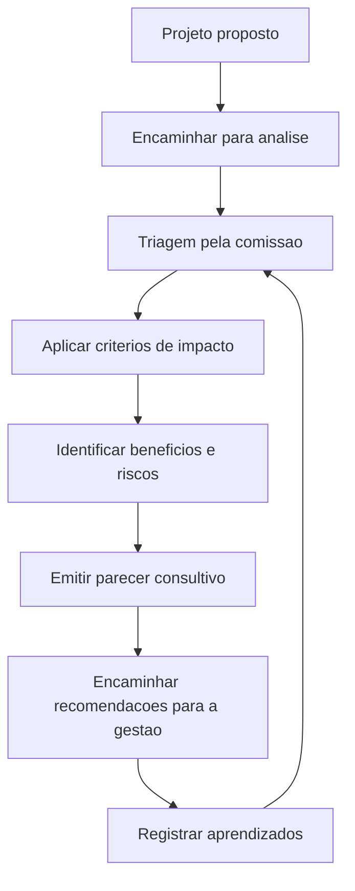

# Comissão de Impacto do Campus

## Contexto

Novos projetos de pesquisa, extensão e inovação podem gerar impactos positivos para o campus, como fortalecimento acadêmico, novas parcerias, melhoria de infraestrutura, formação discente e aproximação com a sociedade. Ao mesmo tempo, também podem gerar impactos que precisam ser previstos e gerenciados, como aumento de consumo de energia, uso intensivo de laboratórios, necessidade de manutenção, ocupação de espaços, demanda administrativa, riscos operacionais e novas responsabilidades institucionais.

Para apoiar a tomada de decisão, será criada uma Comissão de Impacto do Campus com atuação consultiva. A comissão deverá avaliar previamente os impactos potenciais dos projetos e propor recomendações para que os benefícios sejam ampliados e os riscos sejam tratados antes da execução.

## Objetivo

Avaliar, de forma consultiva, como novos projetos de pesquisa, extensão e inovação podem impactar o campus, considerando dimensões acadêmicas, sociais, ambientais, administrativas, financeiras, operacionais e de infraestrutura.

## Escopo

A comissão poderá analisar projetos que:

- Envolvam uso relevante de laboratórios, salas, equipamentos ou áreas comuns.
- Possam aumentar consumo de energia, água, insumos, manutenção ou serviços.
- Envolvam circulação de público externo no campus.
- Demandem apoio administrativo, técnico ou operacional do campus.
- Criem novas parcerias, entregas públicas, compromissos institucionais ou riscos de imagem.
- Possam gerar benefícios acadêmicos, sociais, tecnológicos ou econômicos relevantes.

## Composição sugerida

- Representante da gestão do campus.
- Representante da pesquisa.
- Representante da extensão.
- Representante da inovação ou Agifes, quando necessário.
- Representante do ensino.
- Representante da infraestrutura/manutenção.
- Representante de laboratório ou área técnica relacionada ao projeto analisado.
- Representante de sustentabilidade, segurança ou administração, quando o tema exigir.

## Atribuições

- Receber projetos encaminhados para análise de impacto.
- Verificar impactos positivos e negativos previstos.
- Identificar riscos operacionais, administrativos, ambientais e financeiros.
- Avaliar necessidades de infraestrutura, espaço, equipamentos, energia, água, manutenção e suporte técnico.
- Recomendar ajustes, condicionantes ou encaminhamentos antes da execução.
- Emitir parecer consultivo para apoio à decisão da gestão.
- Registrar aprendizados e melhorar continuamente os critérios de análise.

## Critérios de análise

| Dimensão | Perguntas orientadoras |
| --- | --- |
| Acadêmica | O projeto fortalece ensino, pesquisa, extensão ou inovação? Envolve estudantes? Gera formação ou produção acadêmica? |
| Social | O projeto beneficia a comunidade interna ou externa? Há impacto positivo para o território? |
| Infraestrutura | O projeto demanda salas, laboratórios, equipamentos, manutenção ou adaptações físicas? |
| Energia e recursos | O projeto pode aumentar consumo de energia, água, insumos ou serviços terceirizados? |
| Segurança | Há riscos operacionais, laboratoriais, sanitários, ambientais ou de circulação de pessoas? |
| Administração | O projeto cria novas demandas para compras, contratos, patrimônio, transporte, comunicação ou prestação de contas? |
| Parcerias | O projeto envolve parceiros externos, propriedade intelectual, contrapartidas ou compromissos institucionais? |
| Sustentabilidade | O projeto gera resíduos, emissões, impacto ambiental ou oportunidade de melhoria sustentável? |

## Plano inicial de trabalho

| Etapa | Atividade | Responsáveis sugeridos | Resultado esperado |
| --- | --- | --- | --- |
| 1 | Compor a comissão | Gestão do campus | Lista de membros definida |
| 2 | Definir critérios de análise | Comissão | Matriz de impacto inicial |
| 3 | Criar fluxo de submissão | Comissão e DPPGE | Fluxo de análise consultiva |
| 4 | Criar modelo de parecer | Comissão | Modelo padronizado de parecer |
| 5 | Realizar piloto | Comissão | Projetos reais analisados |
| 6 | Revisar processo | Comissão e gestão | Critérios e fluxo ajustados |

## Cronograma sugerido

| Período | Entrega |
| --- | --- |
| Semana 1 | Composição inicial da comissão |
| Semana 2 | Critérios de análise definidos |
| Semana 3 | Fluxo de submissão documentado |
| Semana 4 | Modelo de parecer consultivo criado |
| Semanas 5 e 6 | Piloto com projetos reais |
| Semana 7 | Ajustes no processo e apresentação à gestão |

## Parecer consultivo

O parecer da comissão deve registrar:

- Identificação do projeto.
- Proponente e unidade responsável.
- Síntese dos impactos positivos esperados.
- Síntese dos impactos negativos ou riscos identificados.
- Necessidades de infraestrutura, energia, equipamentos, manutenção ou apoio administrativo.
- Recomendações da comissão.
- Condicionantes ou encaminhamentos sugeridos.
- Conclusão consultiva.

## Visão geral do fluxo

