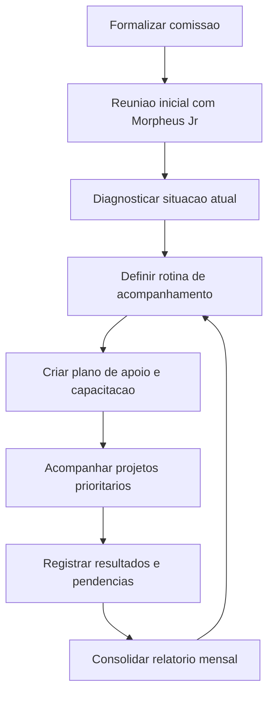

# Comissão de Apoio à Empresa Júnior Morpheus

## Contexto

A Morpheus Jr. é a empresa júnior do Ifes Campus Serra e atua como espaço de formação prática para estudantes, aproximando a vivência acadêmica do mercado por meio de projetos reais, gestão, relacionamento com clientes, custos, metas e desenvolvimento profissional.

Para fortalecer a Morpheus Jr. e apoiar sua organização institucional, será criada uma Comissão de Apoio à Empresa Júnior Morpheus. A comissão terá Adelson Pereira do Nascimento e Jefferson Lima como professores responsáveis, com dedicação prevista de 2 horas semanais para cada professor.

## Base pesquisada

| Fonte | Informação relevante |
| --- | --- |
| [Página oficial do Campus Serra sobre a Morpheus Jr.](https://www.serra.ifes.edu.br/vagas-de-trainee/morpheus-jr-empresa-junior) | Descreve a Morpheus Jr. como empresa júnior do Campus Serra, fundada em 2018, voltada à vivência completa de empresa por estudantes. |
| [Página do Núcleo Incubador do Campus Serra](https://incubadora.serra.ifes.edu.br/component/banners/click/155) | Indica que a Morpheus Jr. é vinculada ao Núcleo Incubador, composta por estudantes voluntários, desenvolve projetos para clientes reais e é federada à JuniorES. |
| [Repositório institucional do Ifes - TCC sobre BI na Morpheus Jr.](https://repositorio.ifes.edu.br/bitstream/handle/123456789/1357/TCC_Necessidade_Implementa%C3%A7%C3%A3o_Sistema_Business_Intelligence.pdf?isAllowed=y&sequence=1) | Aponta a Morpheus Jr. como empresa júnior do Campus Serra, composta por estudantes de Sistemas de Informação e Engenharia de Controle e Automação. |
| [Coordenadoria Geral de Extensão do Campus Serra](https://www.serra.ifes.edu.br/extensao) | Identifica Adelson Pereira do Nascimento como Coordenador Geral de Extensão do Campus Serra. |
| [Perfil de Adelson no Integra Ifes](https://integra.ifes.edu.br/p/adelson-pereira-do-nascimento) | Identifica Adelson como docente do Campus Serra, professor EBTT e coordenador geral de extensão. |
| [Página institucional do Campus Serra](https://www.serra.ifes.edu.br/o-campus-serra?showall=1) | Lista Jefferson Ribeiro de Lima entre os servidores do Campus Serra. |

## Objetivo

Apoiar a Morpheus Jr. na organização, governança, continuidade, relação institucional, acompanhamento de projetos, formação dos estudantes e integração com a extensão, inovação, Núcleo Incubador e demandas do campus.

## Responsáveis

| Responsável | Papel | Carga horária prevista |
| --- | --- | --- |
| Adelson Pereira do Nascimento | Professor responsável pela articulação com extensão, empreendedorismo, Núcleo Incubador e formação dos estudantes | 2 horas semanais |
| Jefferson Lima | Professor responsável pelo apoio técnico, acompanhamento de projetos e orientação da gestão operacional da empresa júnior | 2 horas semanais |

## Atribuições

- Acompanhar a situação atual da Morpheus Jr.
- Apoiar a organização da diretoria estudantil e dos processos internos.
- Orientar planejamento estratégico, portfólio de serviços e metas.
- Apoiar gestão de projetos, relacionamento com clientes e registro de evidências.
- Articular a Morpheus Jr. com o Núcleo Incubador, extensão, inovação e DPPGE.
- Orientar estudantes quanto à formação empreendedora, ética, responsabilidade e prestação de contas.
- Acompanhar reuniões periódicas da empresa júnior.
- Apoiar plano de capacitação dos membros.
- Registrar necessidades institucionais, riscos, gargalos e oportunidades de melhoria.

## Frentes de trabalho

| Frente | Finalidade | Entrega esperada |
| --- | --- | --- |
| Diagnóstico | Levantar situação atual da Morpheus Jr. | Relatório breve de diagnóstico |
| Governança | Apoiar diretoria, papéis, reuniões e decisões | Rotina de governança definida |
| Projetos e clientes | Acompanhar portfólio, contratos, entregas e riscos | Lista de projetos e status |
| Formação | Planejar capacitações para membros | Plano de capacitação |
| Institucional | Articular Núcleo Incubador, extensão, inovação e DPPGE | Fluxo de apoio institucional |
| Comunicação | Organizar apresentação institucional e canais | Materiais atualizados |

## Plano inicial de trabalho

| Etapa | Atividade | Resultado esperado |
| --- | --- | --- |
| 1 | Formalizar a comissão | Adelson e Jefferson Lima designados com 2 horas semanais cada |
| 2 | Realizar reunião inicial com a Morpheus Jr. | Situação atual, demandas e prioridades levantadas |
| 3 | Diagnosticar governança e projetos | Relatório breve de diagnóstico |
| 4 | Definir rotina de acompanhamento | Reuniões, responsáveis e registros definidos |
| 5 | Criar plano de apoio e capacitação | Plano trimestral de ações |
| 6 | Acompanhar projetos prioritários | Projetos com status, riscos e responsáveis registrados |
| 7 | Consolidar relatório de acompanhamento | Resultados e próximos passos documentados |

## Cronograma sugerido

| Período | Entrega |
| --- | --- |
| Semana 1 | Comissão formalizada |
| Semana 2 | Reunião inicial com diretoria da Morpheus Jr. |
| Semana 3 | Diagnóstico da situação atual |
| Semana 4 | Rotina de acompanhamento definida |
| Semana 5 | Plano de apoio e capacitação criado |
| Semanas 6 a 8 | Acompanhamento dos projetos prioritários |
| Mensalmente | Relatório breve de acompanhamento |

## Indicadores sugeridos

- Número de reuniões de acompanhamento realizadas.
- Número de projetos acompanhados.
- Número de estudantes participantes.
- Número de capacitações realizadas.
- Número de entregas ou projetos concluídos.
- Pendências críticas identificadas e resolvidas.
- Grau de atualização dos registros da Morpheus Jr.

## Visão geral do fluxo

