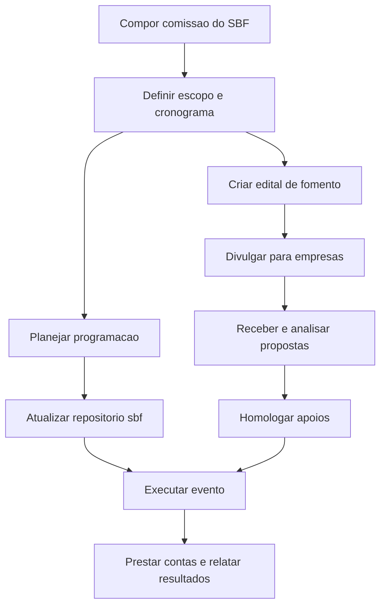

# Comissão de Organização do SBF

## Contexto

O repositório [sbf](https://github.com/ifesserra-lab/sbf) reúne a página do simpósio regional de física hospedado no Campus Serra. Para organizar o evento de forma institucional, será criada uma Comissão de Organização do SBF, envolvendo Richard e Leonardo na condução das atividades acadêmicas, técnicas e de articulação institucional.

A comissão também deverá atuar na criação dos editais de fomento com empresas, usando como referência o processo institucional de [Edital de Patrocínio de Empresas](../processo/edital-patrocinio-empresas.md).

## Objetivo

Organizar o SBF no Campus Serra, garantindo planejamento, programação, comunicação, infraestrutura, gestão da página do evento e captação de apoio por meio de editais de fomento com empresas.

## Composição sugerida

- Richard Godinez.
- Leonardo.
- Representante da gestão do campus.
- Representante da comissão científica ou acadêmica do evento.
- Representante de comunicação.
- Representante administrativo para apoio aos editais, documentos e registros.
- Estudantes ou bolsistas de apoio, quando houver.

## Atribuições

- Definir o escopo, formato e cronograma do SBF.
- Organizar programação científica, palestras, mesas, minicursos ou atividades correlatas.
- Coordenar a atualização da página do evento no repositório [sbf](https://github.com/ifesserra-lab/sbf).
- Criar e acompanhar editais de fomento com empresas.
- Definir cotas, contrapartidas e regras de apoio institucional.
- Articular infraestrutura, salas, equipamentos, comunicação e inscrições.
- Registrar decisões, evidências, resultados e prestação de contas.
- Apresentar relatório final do evento e dos apoios recebidos.

## Frentes de trabalho

| Frente | Responsáveis sugeridos | Entregas esperadas |
| --- | --- | --- |
| Coordenação geral | Richard e Leonardo | Escopo do evento, cronograma e acompanhamento geral |
| Programação científica | Comissão acadêmica | Programação, convidados e atividades |
| Página do evento | Apoio técnico e comunicação | Repositório `sbf` atualizado com informações oficiais |
| Editais de fomento com empresas | Richard, Leonardo, gestão e apoio administrativo | Minuta do edital, anexos, divulgação, análise e resultado |
| Infraestrutura e operação | Gestão, infraestrutura e apoio local | Espaços, equipamentos, logística e suporte |
| Comunicação | Comunicação institucional e comissão | Divulgação, identidade, notícias e registros |

## Editais de fomento com empresas

Os editais de fomento com empresas devem seguir uma lógica pública, transparente e documentada. A comissão deverá:

- Definir objetivo do apoio e vínculo com o SBF.
- Definir público-alvo composto por empresas legalmente estabelecidas.
- Definir modalidades de apoio, cotas ou formas de contribuição.
- Definir contrapartidas institucionais proporcionais e permitidas.
- Criar minuta do edital e anexos necessários.
- Publicar e divulgar a chamada para empresas.
- Receber, analisar e homologar propostas.
- Registrar evidências, apoios recebidos e prestação de contas.

## Plano inicial de trabalho

| Etapa | Atividade | Resultado esperado |
| --- | --- | --- |
| 1 | Compor a comissão | Comissão definida com Richard, Leonardo e apoios necessários |
| 2 | Definir escopo do SBF | Formato, público, datas e objetivos definidos |
| 3 | Planejar programação | Estrutura acadêmica preliminar do evento |
| 4 | Atualizar repositório `sbf` | Página do evento com informações institucionais |
| 5 | Criar edital de fomento | Minuta e anexos prontos para validação |
| 6 | Divulgar edital para empresas | Chamada pública publicada e divulgada |
| 7 | Analisar propostas | Empresas apoiadoras selecionadas |
| 8 | Executar o evento | SBF realizado com registros e evidências |
| 9 | Prestar contas e relatar resultados | Relatório final consolidado |

## Cronograma sugerido

| Período | Entrega |
| --- | --- |
| Semana 1 | Comissão composta e primeira reunião realizada |
| Semana 2 | Escopo, data, formato e responsabilidades definidos |
| Semana 3 | Programação preliminar e necessidades de infraestrutura mapeadas |
| Semana 4 | Página do evento atualizada no repositório `sbf` |
| Semana 5 | Minuta do edital de fomento com empresas elaborada |
| Semana 6 | Edital validado, publicado e divulgado |
| Semanas 7 e 8 | Recebimento e análise das propostas das empresas |
| Após o evento | Relatório final, registros e prestação de contas |

## Documentos e referências

| Documento ou referência | Finalidade |
| --- | --- |
| [Repositório sbf](https://github.com/ifesserra-lab/sbf) | Página e materiais públicos do evento |
| [Processo de Edital de Patrocínio de Empresas](../processo/edital-patrocinio-empresas.md) | Referência para criação dos editais de fomento com empresas |
| Minuta do edital de fomento | Formalizar regras, prazos, modalidades e contrapartidas |
| Formulário de inscrição de empresas | Receber propostas de apoio |
| Resultado de homologação | Publicar empresas habilitadas e apoios aprovados |
| Relatório final | Registrar execução, apoios recebidos, evidências e resultados |

## Visão geral do fluxo

