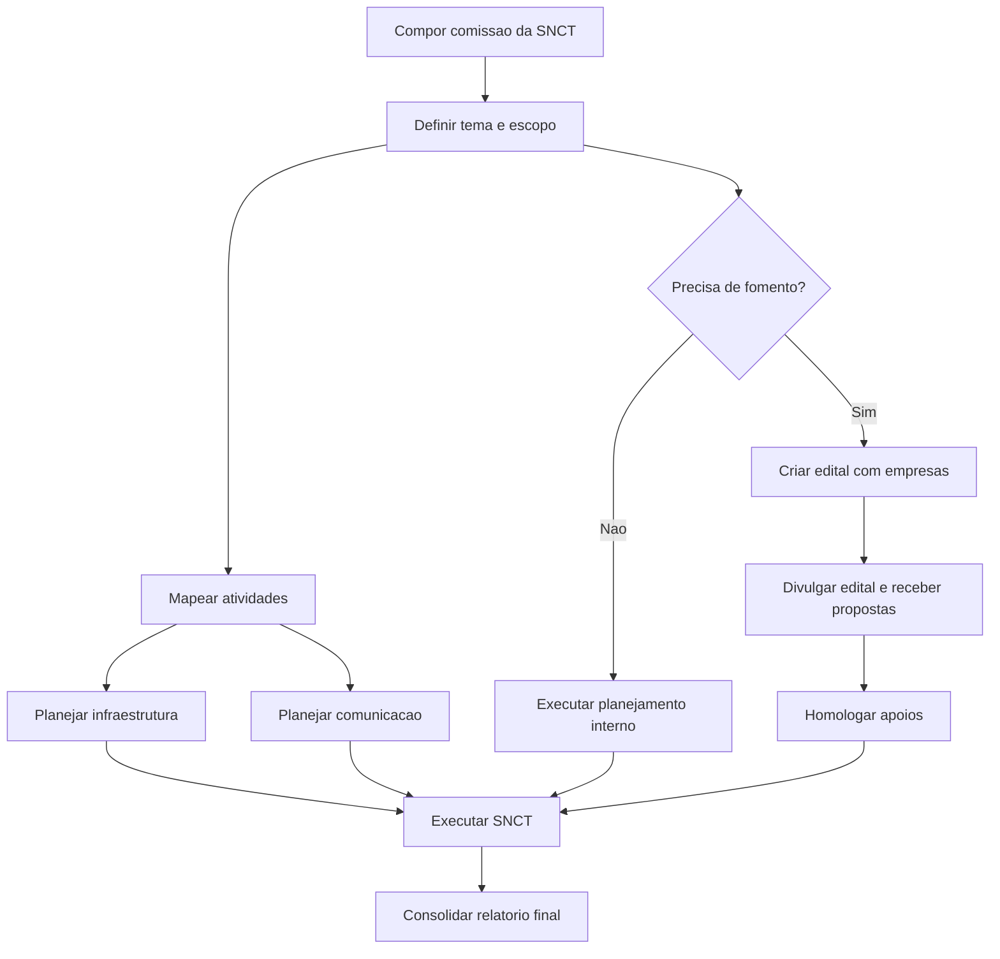

# Comissão da Semana Nacional de Ciência e Tecnologia

## Contexto

A Semana Nacional de Ciência e Tecnologia (SNCT) é uma ação estratégica para aproximar o campus da comunidade, divulgar projetos, fortalecer a cultura científica e articular atividades de ensino, pesquisa, extensão e inovação.

Para organizar a SNCT de forma integrada, será criada uma comissão responsável pelo planejamento, programação, comunicação, infraestrutura, inscrições, registros e articulação com empresas apoiadoras. A comissão também deve utilizar o processo de [Edital de Patrocínio de Empresas](../processo/edital-patrocinio-empresas.md) quando houver necessidade de fomento, apoio institucional ou patrocínio.

## Objetivo

Organizar a SNCT no campus, garantindo planejamento institucional, programação qualificada, participação da comunidade, transparência nos apoios recebidos e registro adequado das atividades realizadas.

## Composição sugerida

- Coordenação geral da SNCT.
- Representante da pesquisa.
- Representante da extensão.
- Representante da inovação ou parcerias.
- Representante da comunicação.
- Representante administrativo.
- Representante de infraestrutura.
- Representantes docentes, técnicos e estudantes vinculados às atividades.

## Atribuições

- Definir tema, escopo, objetivos e público da SNCT no campus.
- Organizar programação de palestras, oficinas, mostras, visitas, exposições e atividades culturais ou científicas.
- Articular participação de projetos de ensino, pesquisa, extensão e inovação.
- Coordenar inscrições, certificados, registros e listas de presença.
- Planejar comunicação, divulgação e identidade do evento.
- Mapear necessidades de salas, laboratórios, equipamentos, segurança, limpeza e apoio operacional.
- Criar e acompanhar editais de fomento ou patrocínio com empresas, quando necessário.
- Registrar evidências, resultados, fotos, relatórios e prestação de contas.

## Frentes de trabalho

| Frente | Finalidade | Entrega esperada |
| --- | --- | --- |
| Coordenação geral | Conduzir planejamento, decisões e acompanhamento | Plano geral da SNCT |
| Programação | Organizar atividades científicas, culturais e formativas | Grade de programação |
| Comunicação | Divulgar evento e orientar participantes | Plano de comunicação |
| Infraestrutura | Garantir espaços, equipamentos e apoio operacional | Mapa de necessidades |
| Inscrições e certificados | Gerenciar participantes e registros | Sistema ou planilha de inscrições |
| Fomento com empresas | Buscar apoio por edital público e transparente | Edital, anexos, divulgação e resultado |
| Registros e relatório | Consolidar evidências e resultados | Relatório final da SNCT |

## Plano inicial de trabalho

| Etapa | Atividade | Resultado esperado |
| --- | --- | --- |
| 1 | Compor a comissão | Comissão definida e responsabilidades distribuídas |
| 2 | Definir tema e escopo | Objetivos, público e formato da SNCT definidos |
| 3 | Mapear atividades | Propostas de oficinas, palestras, mostras e visitas |
| 4 | Planejar infraestrutura | Espaços, equipamentos e apoio operacional definidos |
| 5 | Criar plano de comunicação | Canais, peças e calendário de divulgação definidos |
| 6 | Criar edital de fomento, se necessário | Chamada pública para empresas preparada |
| 7 | Executar a SNCT | Evento realizado com registros e acompanhamento |
| 8 | Consolidar relatório final | Resultados, evidências e prestação de contas organizados |

## Cronograma sugerido

| Período | Entrega |
| --- | --- |
| Semana 1 | Comissão composta e primeira reunião realizada |
| Semana 2 | Tema, escopo, público e formato definidos |
| Semanas 3 e 4 | Programação preliminar construída |
| Semana 5 | Necessidades de infraestrutura e comunicação definidas |
| Semana 6 | Edital de fomento com empresas elaborado, se necessário |
| Semanas 7 e 8 | Divulgação, inscrições e ajustes operacionais |
| Semana do evento | Execução da SNCT |
| Após o evento | Relatório final, evidências e prestação de contas |

## Editais de fomento com empresas

Quando houver necessidade de apoio externo, a comissão deve seguir o processo de [Edital de Patrocínio de Empresas](../processo/edital-patrocinio-empresas.md), garantindo:

- chamada pública institucional;
- critérios transparentes de participação;
- modalidades de apoio ou cotas definidas;
- contrapartidas permitidas e proporcionais;
- registro das propostas recebidas;
- homologação dos apoios;
- relatório final e prestação de contas.

## Documentos e entregas

| Documento | Finalidade |
| --- | --- |
| Plano geral da SNCT | Registrar objetivos, escopo, público, formato e cronograma |
| Grade de programação | Organizar atividades, horários, responsáveis e locais |
| Plano de comunicação | Definir canais, peças e calendário de divulgação |
| Mapa de infraestrutura | Controlar salas, laboratórios, equipamentos e apoios necessários |
| Edital de fomento com empresas | Formalizar apoio externo quando necessário |
| Lista de presença e certificados | Registrar participação |
| Relatório final | Consolidar resultados, evidências e prestação de contas |

## Visão geral do fluxo

