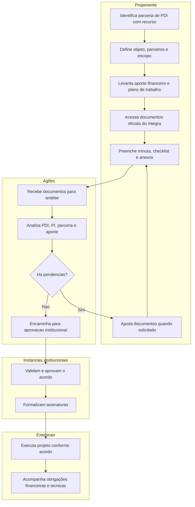

# Processo para Acordo de Parceria de PD&I com aporte de recurso

## Objetivo

Orientar a preparação e o encaminhamento de Acordo de Parceria para Pesquisa, Desenvolvimento e Inovação (PD&I) com aporte de recurso financeiro.

Segundo o Portal Integra IFES, esse acordo pode ser celebrado com instituições públicas ou privadas para atividades conjuntas de pesquisa, ensino e extensão que contemplem desenvolvimento tecnológico e inovação, com transferência de recursos financeiros.

Fonte oficial:

- [Fluxo no Portal Integra IFES](https://integra.ifes.edu.br/institucional/fluxos/acordo-de-parceria-para-pesquisa--desenvolvimento-e-inovacao--pd-i--com-aporte-de-recurso)
- Última atualização informada pela API do Portal Integra: 26/02/2026

## Quando usar este processo

Use este processo quando a parceria de PD&I envolver transferência de recurso financeiro entre os parceiros, incluindo repasse, aporte, execução financeira, plano de aplicação ou obrigação financeira vinculada ao projeto.

## Visão geral do fluxo

## Fluxo do processo

| Etapa | Resultado esperado | Responsável principal |
| --- | --- | --- |
| 1. Caracterizar a parceria | Confirmação de que o acordo é de PD&I com aporte financeiro | Proponente |
| 2. Definir objeto e parceiros | Objeto, instituições envolvidas e responsáveis identificados | Proponente |
| 3. Detalhar o aporte | Valor, forma de aporte, plano de aplicação e obrigações financeiras definidos | Proponente e parceiro |
| 4. Acessar documentos oficiais | Minutas, checklist e orientações consultados no Portal Integra | Proponente |
| 5. Preparar documentação | Minuta e anexos preenchidos conforme o caso concreto | Proponente |
| 6. Encaminhar para análise | Documentos enviados para análise da Agifes | Proponente |
| 7. Analisar PDI, PI e recurso | Pontos técnicos, propriedade intelectual, parceria e aporte avaliados | Agifes |
| 8. Corrigir pendências | Ajustes incorporados aos documentos | Proponente |
| 9. Aprovar institucionalmente | Acordo validado pelas instâncias competentes | IFES / Agifes |
| 10. Formalizar assinatura | Acordo assinado antes do início da execução vinculada ao recurso | IFES, parceiro e demais partes |
| 11. Executar e acompanhar | Projeto executado conforme plano de trabalho e obrigações financeiras | Proponente e parceiros |

## Documentos oficiais

| Documento | Finalidade | Link |
| --- | --- | --- |
| Pasta oficial de documentos para aprovação de APPDI com recursos | Acessar minutas, checklist e documentos oficiais do fluxo com aporte financeiro | [Acessar pasta no SharePoint IFES](https://ifesedubr-my.sharepoint.com/personal/aline_mucellini_ifes_edu_br/_layouts/15/onedrive.aspx?id=%2Fpersonal%2Faline%5Fmucellini%5Fifes%5Fedu%5Fbr%2FDocuments%2FPortal%20INTEGRA%2FReposit%C3%B3rio%20de%20minutas%2FAPROVA%C3%87%C3%83O%20DE%20APPDI%20COM%20RECURSOS&ga=1) |

Observação: a pasta SharePoint pode exigir autenticação institucional. A lista nominal de arquivos deve ser conferida diretamente na pasta oficial.

## Cuidados principais

- Confirmar que há transferência de recurso financeiro. Se não houver, usar o processo sem aporte.
- Detalhar valor, origem, destino, cronograma de desembolso e plano de aplicação.
- Separar obrigações técnicas das obrigações financeiras.
- Verificar cláusulas de propriedade intelectual, confidencialidade, publicação de resultados e exploração econômica.
- Formalizar o acordo antes de iniciar atividades que dependam do aporte financeiro.

## Checklist

- [ ] A parceria foi caracterizada como PD&I com aporte financeiro.
- [ ] O objeto e os parceiros foram definidos.
- [ ] O valor e a forma de aporte foram detalhados.
- [ ] A pasta oficial de documentos do Integra foi consultada.
- [ ] Minuta, checklist e anexos foram preenchidos.
- [ ] A documentação foi encaminhada para análise da Agifes.
- [ ] Pendências foram resolvidas.
- [ ] O acordo foi aprovado institucionalmente.
- [ ] O acordo foi assinado pelas partes.
