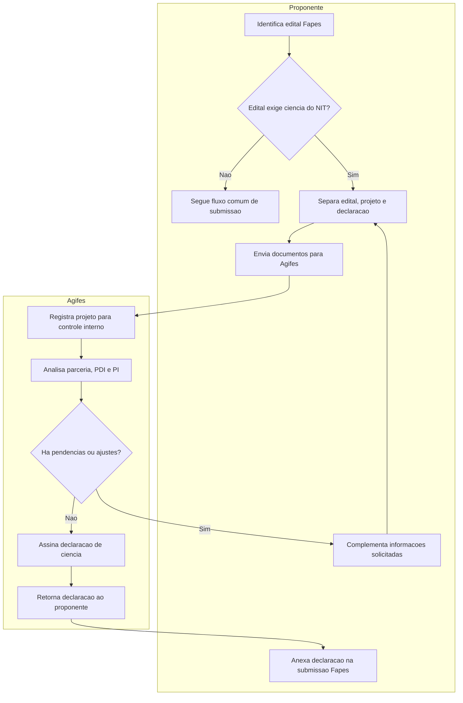

# Processo para declaração de ciência do NIT em editais Fapes

## Objetivo

Organizar o fluxo interno para envio de projetos submetidos a editais de extensão e inovação da Fapes que exijam declaração de ciência do NIT.

A partir de 2026, alguns editais de extensão e inovação da Fapes passaram a prever a apresentação de declaração de ciência do NIT. No IFES, essa declaração é assinada pela Agifes. Para fins de organização, acompanhamento institucional e gestão de parcerias, os projetos e a declaração devem ser encaminhados para:

**editais-agifes.rei@ifes.edu.br**

Esse controle ajuda a registrar os projetos, acompanhar parcerias e mapear cláusulas de propriedade intelectual que possam surgir, apoiando pesquisadores e parceiros nas tratativas de Pesquisa, Desenvolvimento e Inovação (PDI).

## Quando usar este processo

Use este processo sempre que:

- O edital da Fapes for de extensão, inovação, PDI ou área correlata.
- O edital exigir declaração de ciência do NIT.
- O projeto envolver parceria externa, empresa, instituição pública, fundação, laboratório parceiro ou potencial resultado com propriedade intelectual.
- Houver dúvida sobre cláusulas de propriedade intelectual, titularidade, confidencialidade ou exploração de resultados.

## Visão geral do fluxo



## Fluxo do processo

| Etapa | Resultado esperado | Responsável principal |
| --- | --- | --- |
| 1. Identificar exigência do edital | Confirmação de que a declaração de ciência do NIT é necessária | Pesquisador proponente |
| 2. Separar documentos | Projeto e minuta ou modelo de declaração organizados | Pesquisador proponente |
| 3. Encaminhar para a Agifes | E-mail enviado para `editais-agifes.rei@ifes.edu.br` | Pesquisador proponente |
| 4. Registrar controle interno | Projeto registrado para acompanhamento de parcerias e PI | Agifes |
| 5. Analisar pontos de PDI e PI | Riscos, cláusulas e necessidades de orientação identificados | Agifes |
| 6. Emitir declaração | Declaração de ciência assinada pela Agifes | Agifes |
| 7. Devolver ao proponente | Documento disponível para submissão à Fapes | Agifes |

## Documentos necessários

| Documento | Finalidade | Responsável |
| --- | --- | --- |
| Projeto a ser submetido | Permitir análise institucional e registro da parceria | Pesquisador proponente |
| Declaração de ciência do NIT | Documento a ser assinado pela Agifes | Pesquisador proponente / Agifes |
| Dados dos parceiros | Identificar instituições envolvidas e possíveis obrigações | Pesquisador proponente |
| Minuta de parceria, se houver | Verificar cláusulas de propriedade intelectual, sigilo e resultados | Pesquisador proponente |

## Modelo de encaminhamento por e-mail

Assunto sugerido:

```text
Declaração de ciência do NIT - Edital Fapes - [Nome do projeto]
```

Corpo sugerido:

```text
Prezados(as),

Encaminho para análise e emissão da declaração de ciência do NIT referente ao projeto abaixo:

Projeto: [nome do projeto]
Edital Fapes: [número/nome do edital]
Proponente: [nome do pesquisador]
Campus: [campus]
Parceiros envolvidos: [informar parceiros, se houver]
Prazo de submissão: [data]

Seguem anexos o projeto, o edital e o modelo/minuta de declaração, quando disponível.

Atenciosamente,
[nome]
```

## Cuidados importantes

- Encaminhar a solicitação com antecedência, evitando envio no último dia de submissão.
- Informar todos os parceiros envolvidos no projeto.
- Anexar o edital ou indicar claramente o link oficial do edital.
- Destacar cláusulas sobre propriedade intelectual, confidencialidade, titularidade de resultados ou exploração econômica.
- Guardar o e-mail enviado e a declaração recebida.
- Informar à DPPGE quando o projeto for submetido, aprovado ou contratado.

## Checklist

- [ ] O edital exige declaração de ciência do NIT.
- [ ] O projeto está em versão revisada para envio.
- [ ] O edital ou link oficial foi separado.
- [ ] Os parceiros foram identificados.
- [ ] A minuta/modelo de declaração foi anexada, se houver.
- [ ] O e-mail foi enviado para `editais-agifes.rei@ifes.edu.br`.
- [ ] A declaração assinada foi recebida.
- [ ] A declaração foi anexada à submissão na Fapes.
