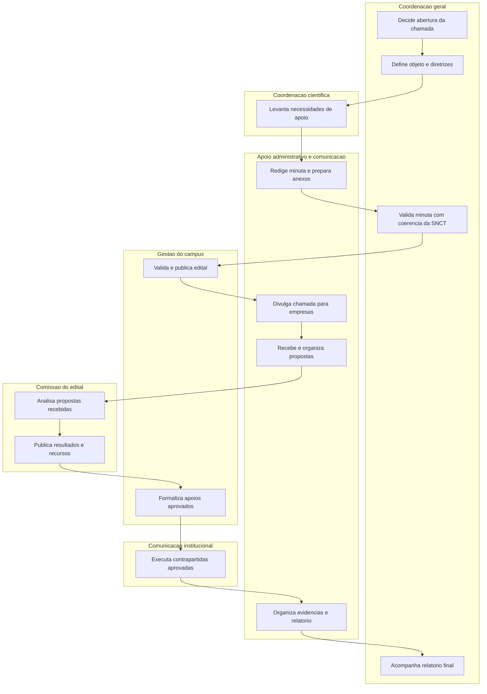

# Processo para criar edital de patrocínio com empresas

## Objetivo

Definir um processo prático para criar, publicar, acompanhar e prestar contas de uma chamada pública de patrocínio e apoio institucional com empresas para a SNCT 2026 - Ciência Delas no IFES.

Este processo usa como referência o modelo adotado pelo IFES Campus Colatina nos editais de apoio à equipe Titãs da Robótica, especialmente a lógica de chamamento público, público-alvo empresarial, cotas ou formas de apoio, contrapartidas proporcionais, formulário de inscrição, análise das propostas, publicação de resultados e relatório final.

Referências:

- Edital 09/2024 - Chamamento público de patrocínio para a equipe Titãs da Robótica: https://colatina.ifes.edu.br/chamadas-publicas/17723-edital-09-2024-chamamento-publico-de-patrocinio-para-a-equipe-titas-da-robotica
- Edital nº 13/2022 - Chamada pública para captação de patrocínio e apoio para equipe Titãs da Robótica: https://colatina.ifes.edu.br/images/cse2022/editais/Edital_TitasDaRobotica_2022.pdf
- Página de chamadas públicas do IFES Campus Colatina: https://colatina.ifes.edu.br/chamadas-publicas

## O que aproveitar do modelo Titãs da Robótica

O modelo dos Titãs da Robótica é útil porque organiza o patrocínio como uma chamada pública institucional, e não como contato informal com empresas. Para a SNCT, a adaptação deve manter esse caráter público, transparente e documentado.

Elementos a aproveitar:

- Título claro do edital como chamada pública para captação de patrocínio e apoio.
- Objeto delimitado, informando exatamente o que será apoiado.
- Público-alvo composto por empresas públicas e privadas legalmente estabelecidas.
- Período de inscrição e forma de submissão da proposta.
- Descrição dos itens ou despesas que podem ser apoiados.
- Contrapartidas proporcionais ao apoio concedido.
- Cronograma com publicação, homologação, resultado, recurso, homologação final e relatório.
- Publicação dos resultados em página institucional.
- Relatório final aos patrocinadores ou apoiadores.

Adaptações necessárias para a SNCT:

- O objeto deve priorizar educação, popularização científica, participação de escolas e protagonismo de mulheres.
- As contrapartidas devem ser institucionais e moderadas, sem transformar o evento em ação comercial.
- A empresa apoiadora não pode interferir na curadoria científica, pedagógica ou no público atendido.
- As ações devem proteger o público escolar e respeitar a imagem institucional do IFES.
- Os registros de patrocínio devem ficar separados dos registros de eventual recurso CNPq.

## Visão geral do fluxo

## Fluxo do processo

| Etapa | Resultado esperado | Responsável principal |
| --- | --- | --- |
| 1. Decisão de abertura | Autorização interna para criar chamada de patrocínio | Coordenadora geral |
| 2. Levantamento de necessidades | Lista de itens, serviços e apoios que podem receber patrocínio | Coordenadora científica |
| 3. Redação da minuta | Primeira versão do edital e anexos | Apoio administrativo, comunicação e registros |
| 4. Validação institucional | Minuta revisada pela gestão/administração do campus | Coordenadora geral |
| 5. Publicação | Edital e anexos publicados em canal institucional | Gestão/administração do campus |
| 6. Divulgação ativa | Empresas locais comunicadas de forma institucional | Apoio administrativo e comunicação |
| 7. Recebimento de propostas | Propostas registradas e organizadas | Apoio administrativo |
| 8. Análise | Propostas habilitadas, não habilitadas e classificadas | Comissão do edital |
| 9. Resultado e recursos | Resultado preliminar, prazo de recurso e resultado final publicados | Comissão do edital |
| 10. Formalização | Apoios aceitos formalizados conforme orientação do campus | Gestão/administração e apoio administrativo |
| 11. Execução das contrapartidas | Contrapartidas entregues e registradas | Comunicação institucional ou NAC |
| 12. Relatório final | Relatório de uso do apoio e evidências organizado | Coordenadora geral e apoio administrativo |

## Papéis e responsabilidades

| Papel | Responsabilidades | Entregáveis |
| --- | --- | --- |
| Coordenadora geral / proponente | Decidir abertura da chamada, articular gestão do campus, aprovar escopo, validar contrapartidas e garantir coerência com a SNCT | Decisão registrada, minuta aprovada, comissão definida |
| Apoio administrativo, comunicação e registros | Redigir minuta, preparar anexos, organizar planilha de empresas, receber documentos, controlar prazos e evidências | Edital, anexos, planilha de controle, pasta de evidências |
| Coordenadora científica e de atividades | Informar necessidades reais das oficinas, mostras e atividades científicas | Lista de itens financiáveis e prioridades de apoio |
| Coordenadora pedagógica e de escolas | Avaliar se o patrocínio preserva o caráter educativo e o público escolar | Parecer pedagógico simples sobre aderência e riscos |
| Representante da gestão/administração do campus | Orientar fluxo institucional, publicação, documentos exigidos e formalização do apoio | Validação administrativa, publicação e resultado homologado |
| Comissão do edital | Analisar propostas, verificar documentação, aplicar critérios e registrar resultado | Ata de análise, resultado preliminar, resultado final |
| Comunicação institucional ou NAC | Divulgar chamada, organizar identidade visual permitida e registrar contrapartidas | Publicações, artes, fotos, painel de apoiadores e links |

## Tarefas do processo

| Código | Início sugerido | Fim sugerido | Tarefa | Descrição | Responsável | Entregável |
| --- | --- | --- | --- | --- | --- | --- |
| PAT-01 | 08/06/2026 | 10/06/2026 | Confirmar abertura do processo | Validar com a equipe e a gestão se haverá chamada pública de patrocínio para a SNCT. | Coordenadora geral | Decisão registrada |
| PAT-02 | 08/06/2026 | 11/06/2026 | Definir objeto do edital | Adaptar o objeto do modelo Titãs para a SNCT, deixando claro que o apoio será para atividades gratuitas de ciência, tecnologia e educação. | Coordenadora geral | Texto do objeto |
| PAT-03 | 10/06/2026 | 13/06/2026 | Levantar necessidades de apoio | Listar materiais, serviços e apoios desejados, separando o que pode ser solicitado ao CNPq e o que pode ser recebido via patrocínio. | Coordenadora científica | Lista priorizada de necessidades |
| PAT-04 | 10/06/2026 | 13/06/2026 | Definir cotas e contrapartidas | Criar cotas de apoio e contrapartidas proporcionais, evitando publicidade invasiva ou interferência pedagógica. | Apoio administrativo e comunicação | Quadro de cotas e contrapartidas |
| PAT-05 | 11/06/2026 | 14/06/2026 | Preparar anexos | Criar formulário de proposta, declaração de ciência, modelo de plano de aplicação do apoio e termo de autorização de uso de marca, se necessário. | Apoio administrativo | Anexos do edital |
| PAT-06 | 13/06/2026 | 17/06/2026 | Revisar com gestão/administração | Submeter minuta e anexos à gestão do campus para ajustes institucionais e administrativos. | Coordenadora geral | Minuta validada |
| PAT-07 | 13/06/2026 | 17/06/2026 | Montar lista de empresas | Mapear empresas locais compatíveis com educação, ciência, tecnologia, indústria, comércio e responsabilidade social. | Apoio administrativo | Planilha de empresas |
| PAT-08 | 18/06/2026 | 18/06/2026 | Publicar edital | Publicar chamada, cronograma e anexos em página institucional ou canal definido pelo campus. | Gestão/administração do campus | Edital publicado |
| PAT-09 | 18/06/2026 | 05/07/2026 | Divulgar e receber propostas | Enviar comunicação institucional às empresas e registrar propostas recebidas. | Apoio administrativo e comunicação | Propostas protocoladas |
| PAT-10 | 06/07/2026 | 10/07/2026 | Analisar propostas | Conferir documentos, vedações, compatibilidade, contrapartidas e eventuais conflitos de interesse. | Comissão do edital | Ata de análise |
| PAT-11 | 13/07/2026 | 17/07/2026 | Publicar resultados | Publicar resultado preliminar, receber recursos ou ajustes e publicar resultado final. | Comissão do edital | Resultado final homologado |
| PAT-12 | 20/07/2026 | 31/07/2026 | Formalizar apoios | Formalizar apoio financeiro, material ou serviço conforme orientação da gestão/administração. | Gestão/administração e apoio administrativo | Apoio formalizado |
| PAT-13 | 01/08/2026 | 01/11/2026 | Executar contrapartidas | Entregar contrapartidas aprovadas, como menção institucional, logomarca em painel ou certificado de apoio. | Comunicação institucional ou NAC | Contrapartidas entregues |
| PAT-14 | 02/11/2026 | 30/11/2026 | Preparar relatório final | Consolidar documentos, fotos, links, registros de uso do apoio e memória das contrapartidas. | Coordenadora geral e apoio administrativo | Relatório final |

## Lista mínima de documentos

| Documento | Finalidade | Responsável |
| --- | --- | --- |
| Edital de chamada pública | Definir objeto, regras, público-alvo, inscrições, critérios, contrapartidas e cronograma | Apoio administrativo, comunicação e registros |
| Formulário de inscrição ou submissão | Receber proposta da empresa, dados do responsável, CNPJ e documentos exigidos | Apoio administrativo, comunicação e registros |
| Retificação, se necessária | Alterar prazo, cronograma ou item do edital de forma pública | Comissão do edital |
| Homologação das inscrições | Informar empresas inscritas e habilitadas para seguir no processo | Comissão do edital |
| Resultado preliminar | Publicar primeira decisão da comissão, quando aplicável | Comissão do edital |
| Resultado final ou homologação | Publicar empresas aprovadas e modalidade de apoio | Gestão/administração do campus |
| Termo ou ofício de formalização | Registrar apoio aceito, entrega e contrapartida autorizada | Gestão/administração e apoio administrativo |
| Plano de entrega das contrapartidas | Controlar publicações, logomarcas, certificados e evidências | Comunicação institucional ou NAC |
| Relatório final aos patrocinadores | Apresentar execução, uso do apoio e contrapartidas entregues | Coordenadora geral e apoio administrativo |

## Modelo resumido de cronograma do edital

| Etapa | Data sugerida |
| --- | --- |
| Abertura do edital | 18/06/2026 |
| Encerramento das inscrições | 05/07/2026 |
| Publicação das inscrições homologadas | 08/07/2026 |
| Divulgação do resultado preliminar | 13/07/2026 |
| Período para recursos ou ajustes | 14/07/2026 a 16/07/2026 |
| Homologação do resultado final | 17/07/2026 |
| Formalização dos apoios | A partir de 20/07/2026 |
| Execução das contrapartidas | 01/08/2026 a 30/11/2026 |
| Relatório final aos apoiadores | Até 30/11/2026 |

## Cuidados antes da publicação

- Validar o fluxo com a direção, administração ou setor responsável do campus.
- Confirmar se haverá necessidade de parecer jurídico ou administrativo.
- Evitar promessa de exclusividade comercial.
- Evitar exposição de marca em atividades diretamente voltadas a crianças e adolescentes sem cuidado institucional.
- Proibir qualquer interferência do patrocinador na seleção de estudantes, conteúdo científico, falas, oficinas ou resultados.
- Separar completamente a gestão do patrocínio da gestão de recursos públicos recebidos por edital, como o CNPq.
- Registrar tudo em pasta compartilhada e no Project da SNCT.

## Checklist final

- [ ] Decisão de abertura registrada.
- [ ] Objeto definido.
- [ ] Necessidades de apoio levantadas.
- [ ] Cotas e contrapartidas definidas.
- [ ] Vedações revisadas.
- [ ] Minuta do edital redigida.
- [ ] Anexos criados.
- [ ] Gestão/administração do campus consultada.
- [ ] Comissão definida.
- [ ] Edital publicado.
- [ ] Empresas comunicadas.
- [ ] Propostas recebidas e registradas.
- [ ] Ata de análise criada.
- [ ] Resultado preliminar publicado.
- [ ] Resultado final homologado.
- [ ] Apoios formalizados.
- [ ] Contrapartidas executadas.
- [ ] Relatório final concluído.
