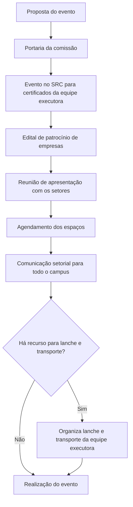

# Processo para organizar eventos institucionais no campus

## Objetivo

Registrar os aprendizados da organização do V Encontro Capixaba de Física/SBF 2026 no Campus Serra e transformá-los em um roteiro que possa ser reaproveitado por outras comissões de eventos do campus.

O foco é o que acontece antes do evento: formalizar a comissão, reconhecer a equipe executora, buscar apoio de empresas, envolver os setores que vão apoiar o evento e garantir espaços, comunicação e estrutura com antecedência.

Referência: [Comissão de Organização do SBF](../comissao/comissao-sbf.md).

## Quando usar este processo

Use este processo sempre que:

- O campus for sediar ou organizar um evento acadêmico, científico, de extensão ou institucional.
- O evento envolver uma equipe executora com servidores e estudantes.
- O evento depender do apoio de outros setores do campus, como TI, Manutenção, Segurança ou Comunicação.
- O evento ocupar espaços do campus ou afetar a rotina de aulas.
- O evento precisar de apoio financeiro ou material de empresas.

## Visão geral do fluxo

## Fluxo do processo

| Etapa | Resultado esperado | Responsável principal |
| --- | --- | --- |
| 1. Criar portaria da comissão | Comissão responsável pelo evento formalizada | Gestão do campus / comissão do evento |
| 2. Criar o evento no SRC | Ação cadastrada para emissão de certificados da equipe executora | Coordenação do evento |
| 3. Criar o edital de patrocínio de empresas | Chamada pública para captar apoio de empresas ao evento, seguindo o processo de [Edital de Patrocínio de Empresas](edital-patrocinio-empresas.md) | Comissão do evento |
| 4. Apresentar a proposta aos setores | Setores de apoio cientes do evento e do que se espera de cada um | Coordenação do evento |
| 5. Agendar os espaços | Salas, auditórios e áreas reservados com antecedência | Coordenação do evento |
| 6. Fazer a comunicação setorial | Todo o campus informado sobre o evento, datas e impactos | Coordenação do evento / Comunicação |
| 7. Preparar lanche e transporte | Equipe executora de estudantes com lanche e transporte garantidos, caso haja recurso | Coordenação do evento / gestão do campus |

## Setores envolvidos na reunião de apresentação

A reunião de apresentação da proposta do evento deve reunir os responsáveis pelos setores abaixo. Cada um tem um papel no apoio ao evento.

| Setor | Como pode apoiar |
| --- | --- |
| Comunicação | Auxiliar na divulgação do evento. |
| TI | Auxiliar nos aspectos técnicos do evento, como a rede Wi-Fi. |
| Segurança | Auxiliar na prevenção de riscos ligados à segurança do campus. |
| Manutenção | Auxiliar na movimentação ou construção de estruturas necessárias ao evento. |
| Enfermaria | Auxiliar nos procedimentos de saúde durante o evento. |
| CAE | Auxiliar nas demandas que envolvam os estudantes. |
| Ensino | Verificar o impacto do evento nas aulas e orientar como pedir apoio aos professores. |

## Cuidados importantes

- Criar a portaria e o evento no SRC no início, para que toda a equipe executora seja reconhecida e certificada ao final.
- Lançar o edital de patrocínio cedo: chamada pública, análise das propostas e formalização levam tempo, e o recurso captado pode cobrir lanche, transporte e estrutura.
- Fazer a reunião com os setores com antecedência suficiente para que cada um consiga se planejar.
- Agendar os espaços assim que as datas estiverem definidas, evitando conflitos com outras atividades do campus.
- Conversar com o Ensino antes de divulgar o evento, principalmente quando houver impacto nas aulas.
- Verificar cedo se há recurso para lanche e transporte dos estudantes da equipe executora.

## Checklist

- [ ] A portaria da comissão responsável pelo evento foi publicada.
- [ ] O evento foi criado no SRC para emissão dos certificados da equipe executora.
- [ ] O edital de patrocínio de empresas foi publicado, se o evento precisar de apoio externo.
- [ ] A reunião de apresentação foi realizada com Comunicação, TI, Segurança, Manutenção, Enfermaria, CAE e Ensino.
- [ ] Os espaços necessários foram agendados.
- [ ] A comunicação setorial foi enviada para todo o campus.
- [ ] O lanche e o transporte da equipe executora foram organizados, caso haja recurso.
